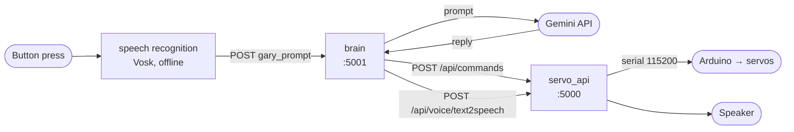

# Gary — an InMoov robot brain

Software for [Gary](https://inmoov.fr/), a 3D-printed InMoov humanoid. A Raspberry Pi
handles conversation, speech and vision; an Arduino drives the servos. Press a button,
talk to him, and he answers out loud while moving his mouth and head.

This started as a hackathon project in 2016 and has been rebuilt piecemeal ever since.
It is shared in the hope that it is useful to other InMoov builders — but read
[Known limitations](#known-limitations) first, because parts of it assume specific
hardware.

## How it works



Three processes, started together by `scripts/start_all.sh`:

| Service | Port | Responsibility |
|---|---|---|
| `servo_api/server.py` | 5000 | Owns the Arduino serial link; moves servos; text-to-speech |
| `brain/app.py` | 5001 | Sends prompts to Gemini; drives mouth and speech |
| `brain/gary_local_speech_recognition.py` | — | Push-to-talk recording and offline transcription |

A full exchange takes roughly 8 seconds: about 3 for the model, about 5 for speech.

**Start the servo API first.** The brain calls back into it for both speech and
servo movement, and will fail silently if it isn't listening.

## Hardware

- Raspberry Pi 4 (developed on Raspberry Pi OS 10 "buster", Python 3.7)
- Arduino with an Adafruit PCA9685 PWM driver, connected over USB serial at 115200 baud
- Google AIY Voice HAT — supplies the button, the LED and text-to-speech
- Raspberry Pi Camera Module on the CSI ribbon connector (optional; see limitations)

The Arduino firmware is **not** in this repository. It lives in
[ArduinoServoController-UART-InMoov](https://github.com/Lukeluca/ArduinoServoController-UART-InMoov),
and is treated here as a fixed API: the Pi sends it short ASCII commands (`HH:60`,
`HM+15`) over serial, two letters for the servo plus an absolute or relative value.
See `servo_api/pin_and_servos.py` for the servo map.

## Setup

First flash the Arduino with
[ArduinoServoController-UART-InMoov](https://github.com/Lukeluca/ArduinoServoController-UART-InMoov)
— nothing here can move a servo without it. Then:

```bash
git clone <your-fork> gary
cd gary
cp brain/.env.example brain/.env
```

Add your [Google AI Studio key](https://aistudio.google.com/apikey) to `brain/.env`
as `GOOGLE_API_KEY`. Then install dependencies:

```bash
pip3 install -r servo_api/requirements.txt -r brain/requirements.txt
```

The AIY packages (`aiy.board`, `aiy.voice`) come from the Voice Kit system image, not
from pip.

## Running

```bash
./scripts/start_all.sh
```

Press and hold the button, speak, then release. Release is what ends the recording.

To verify the pipeline without a button press:

```bash
curl -X POST http://localhost:5001/ --data-urlencode "gary_prompt=say hello"
```

To stop everything:

```bash
pkill -f "[s]erver.py|[f]lask run|[g]ary_local_speech"
```

### Starting automatically on power-on

```bash
./scripts/install-systemd.sh
systemctl --user start gary.target
```

That installs three units plus a `gary.target` that groups them, and enables
lingering so they come up at power-on without anyone logging in.

```bash
systemctl --user status gary-servo     # one service
systemctl --user stop gary.target      # all three
sudo journalctl --user-unit gary-brain -f
```

These are deliberately **user** units rather than system units. The AIY
voiceHAT is held exclusively by PulseAudio, which runs inside the desktop
user's systemd session, so a system-scope service cannot reach the sound card:
`aplay` fails with "Device or resource busy" and text-to-speech returns a 500
while every other part of the pipeline looks healthy. Gary moves his mouth and
makes no sound. Running in the user session avoids that entirely.

## Configuration

The model is set in `brain/app.py`. It currently uses `gemini-flash-lite-latest` —
an alias rather than a pinned version, deliberately: this project previously broke
when `gemini-1.5-flash` was retired, and pinning is not a safe harbour, since
retired models can be closed to new users entirely.

Gary's personality lives in the `system_instruction` string in
`brain/app.py:google_generate_content`. Change it there to give your robot its own
character.

## Known limitations

These are real and worth understanding before you invest time:

- **Vision is disabled.** The `Sight` class in `servo_api/gary_api.py` is commented
  out. It contains working Haar-cascade face detection and head-tracking, but needs
  an OpenCV new enough to provide `cv2.data` (4.x). The system OpenCV on buster is
  3.2, which is too old.
- **Requires the AIY Voice HAT.** The button, LED and text-to-speech all come from
  `aiy.*`. Without that discontinued board the code fails at import. Making this
  portable means abstracting a trigger source and a TTS backend.
- **The mouth does not articulate.** It opens, holds through the whole utterance,
  then closes — there is no lip-sync.
- **`archive/`** holds superseded code kept for reference. It is not wired up.

## Layout

```
brain/       conversation: Gemini, speech recognition, web UI
servo_api/   motion and speech output; owns the Arduino serial link
scripts/     start_all.sh
archive/     superseded earlier versions, not in use
```

## Licence

MIT — see [LICENSE](LICENSE).
